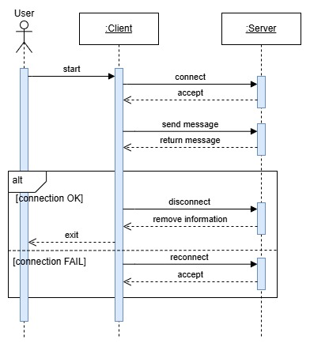

# Chat Application with TCP Connection

## Contents

* [Overview](#Overview)
* [Program Design](#Program-Design)
    * [Disconnections](#Disconnections)
    * [Synchronization](#Synchronization)
    * [UML Sequence Diagram](#UML-Sequence-Diagram)
* [Demonstration](#Demonstration)
* [Credit](#Credit)

## Overview
We developed a chat application in **Python** to implement a **Client-Server Model** via **Transmission Control Protocol (TCP)**. We built this to meet the following base requirement :

<b>The chat service provider (i.e. server) must be able to manage multiple clients in the system without a significant drop in performance.</b>

## Program Design

The server and clients are managed via `multiprocessing` as these represent seperate entities (i.e. each have their own code section and **Global Interpreter Lock (GIL)**).

Handshakes are performed and messages are handled (i.e. received/sent from client to server) via `multithreading` for concurrency.

### Disconnections

There has been error handling implemented for both the chat server and clients to appropriately handle disconnections, including a client leaving the system, as well as server shutdown.

We have implemented this, such that the same client can attempt reconnection and communicate via a reestablished server application.

### Synchronization

The server threads which handle client messages implement **Inter-Process Communication (IPC)** via *memory sharing*. They have read-write access to the `socketInfo` data field, which is a `list` of `dicts` (i.e. with the `socket` object and `address` tuple).

If a client socket is closed and a server thread is unable to successfully send a message, it removes the socket information from the `socketInfo` data field in a critical section.

This is to ensure other threads are made aware of this client leaving the system, as well as to avoid subsequent communication attempts by the current thread.

### UML Sequence Diagram

We have illustrated the following **UML Sequence Diagram** to describe the high-level interactions in our program.

    

<i>Note that all connections and disconnections are implemented via **TCP**.</i>

## Demonstration

We have uploaded our Final Demo on <a href="https://www.youtube.com/watch?v=xPEcu-LOH6w" target="_blank">Youtube</a>.

https://github.com/user-attachments/assets/21df3b99-2e14-4370-8d2d-40f4f7108a3f

## Credit

This was completed as part of the <b>CPEN 333 - Software Design</b> course in the <b>The University of British Columbia Electrical and Computer Engineering</b> undergraduate program. We received tremendous support and guidance from Dr. Farshid Agharebparast.
